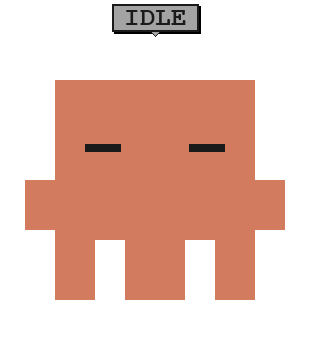

# Claude Pet

A small floating companion that reacts in real time to [Claude Code](https://claude.com/claude-code)'s activity: a pixel-art character in a native, always-on-top window, changing expression and animation based on what Claude is doing (editing, waiting, error, done...).

macOS (Apple Silicon) only for now.

<p align="center"></p>

*(GIF generated directly from `src/pet.html`, micro-animations included — not a real screen recording, but faithful to the actual rendering.)*

## Installation

```bash
git clone git@github.com:valadedamien/claude-pet.git
cd claude-pet
./install.sh
```

`install.sh` copies the files into `~/.claude/pet/`, downloads the precompiled binary (latest [GitHub Release](https://github.com/valadedamien/claude-pet/releases/latest)) — **no Python dependency to install to run the app itself**, only `python3` (already present on most dev Macs) is required for the small hook scripts. The necessary hooks are added to `~/.claude/settings.json` **without touching your existing hooks** (idempotent merge, automatic backup before any change).

Open (or restart) `claude` in a terminal: the pet appears automatically.

## Uninstallation

```bash
./uninstall.sh
```

Removes only the hooks added by Claude Pet, closes any active windows, and deletes `~/.claude/pet/`.

## How it works

- **One pet per conversation**: each `claude` session gets its own window, its own color (out of a palette of 6), positioned in a cascade so they don't overlap. Automatic closing (clean via `SessionEnd`, or via a safety net that checks every ~3s that the parent `claude` process is still alive) if the session ends, even abruptly.
- **5 states**: idle (`SessionStart`, then again after a "done" left inactive), working (`UserPromptSubmit` then `PreToolUse` — stays active for the whole turn, no reverting to idle between two tools), waiting for confirmation (`PermissionRequest`), error (`PostToolUseFailure`), done (`Stop`).
- **Click to find the terminal**: clicking the pet brings to the front the application (Terminal, iTerm, VS Code...) that launched this session.
- Pixel-art design made with Claude Design, implemented in plain SVG/CSS/JS (no rendering dependency).

## Project structure

```
install.sh          # copies the files, downloads the binary (Release), adds the hooks
uninstall.sh         # removes the hooks, closes the pets, deletes ~/.claude/pet
src/
  pet.html            # rendering (SVG + CSS + JS), state driven by window.setPetState/setPetSkin
  pet_app.py           # pywebview window, one process per session, watchdog, click → focus
  update_state.sh      # called by Claude Code hooks, writes state per session
  start_pet.sh          # launches the compiled app for a given session
  install_hooks.py      # idempotent merge of hooks into settings.json
build/
  setup.py              # py2app config to compile src/pet_app.py
  build.sh               # build + zip → build/dist/Claude-Pet-macos-arm64.zip
```

To tweak the design (colors, shapes, state labels), everything happens in `src/pet.html` (the `STATES` object in JS, the SVG `<g data-only="...">` blocks). `pet.html` is copied as-is by `install.sh`, so there's no need to recompile for this file — just rerun `./install.sh`.

To modify `pet_app.py` (Python logic: sessions, watchdog, click → focus...), you need to rebuild and publish a new release:

```bash
./build/build.sh                          # produces build/dist/Claude-Pet-macos-arm64.zip
gh release create v0.x.0 build/dist/Claude-Pet-macos-arm64.zip --title "..." --notes "..."
```

`install.sh` always downloads the **latest** release, so colleagues get the update on their next `git pull` + `./install.sh`.
